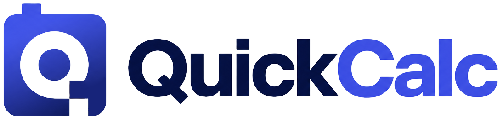

<p align="center">
	
</p>

# QuickCalc

A local-first desktop app for quick math, AI-assisted chat, and markdown notes. Built with Electron and plain HTML, CSS, and JavaScript.

> All data stays local in `localStorage`. No account. No telemetry.

## Install

```bash
npm install
```

## Development Run

```bash
npm start
```

Use `npm start` to launch the Electron app locally while iterating on the UI and app logic.

## Build

```bash
npm run build
npm run build:portable
npm run build:installer
```

- `npm run build` packages the app with the default `electron-builder` target.
- `npm run build:portable` creates a Windows portable build.
- `npm run build:installer` creates a Windows NSIS installer.

## Editor Bundle

```bash
npm run build:editor
```

Rebuild the bundled CodeMirror editor output after changing `src/vendor/codemirror-entry.js` or upgrading editor dependencies.
